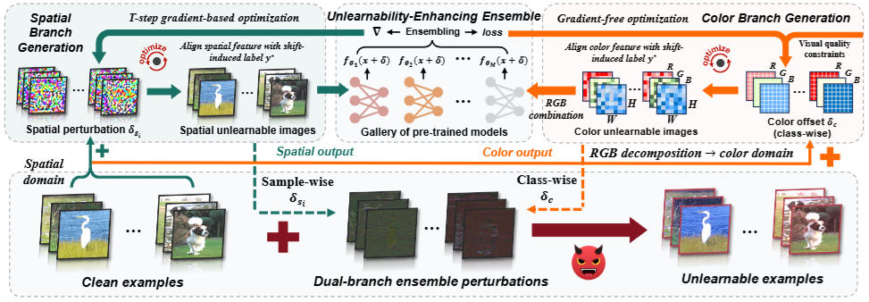

# DUNE
The official implementation of our ICML 2026 paper "*[Dual-branch Robust Unlearnable Examples](https://arxiv.org/pdf/)*", by *[Xianlong Wang](https://wxldragon.github.io/), [Hangtao Zhang](https://scholar.google.com.hk/citations?user=H6wMyNEAAAAJ&hl=zh-CN), [Wenbo Pan](https://www.wenbo.io/zh-CN/), [Ziqi Zhou](https://zhou-zi7.github.io/), Changsong Jiang, Li Zeng, and [Xiaohua Jia](https://www.cs.cityu.edu.hk/~jia/).*

 

 

## Abstract
Unlearnable examples (UEs) aim to compromise model training by injecting imperceptible perturbations to clean samples. However, existing UE schemes exhibit limited robustness against advanced defenses due to their heuristic design or narrowly scoped domain perturbations. To address this, we propose DUNE, a Dual-branch UNlearnable Ensemble perturbation optimization approach. Specifically, DUNE separately optimizes perturbations in the spatial and color domains to establish the mapping between perturbations and shift-induced labels. This design extends the perturbation domain to increase noise intensity for improving robustness and drives the models to learn perturbation-oriented features with degraded generalization, thereby achieving unlearnability. To strengthen DUNE's performance, we further propose an unlearnability-enhancing ensemble strategy that aggregates diverse pre-trained models during the dual-branch optimization. Extensive experiments on benchmark datasets CIFAR-10 and ImageNet verify that DUNE's robustness outperforms 12 SOTA UE schemes under 7 mainstream defenses, yielding a lower average test accuracy of 14.95% to 50.82%.

  

## Latest Update
| Date       | Event    |
| **2026/05/01** | DUNE is acccepted by ICML 2026!  |
